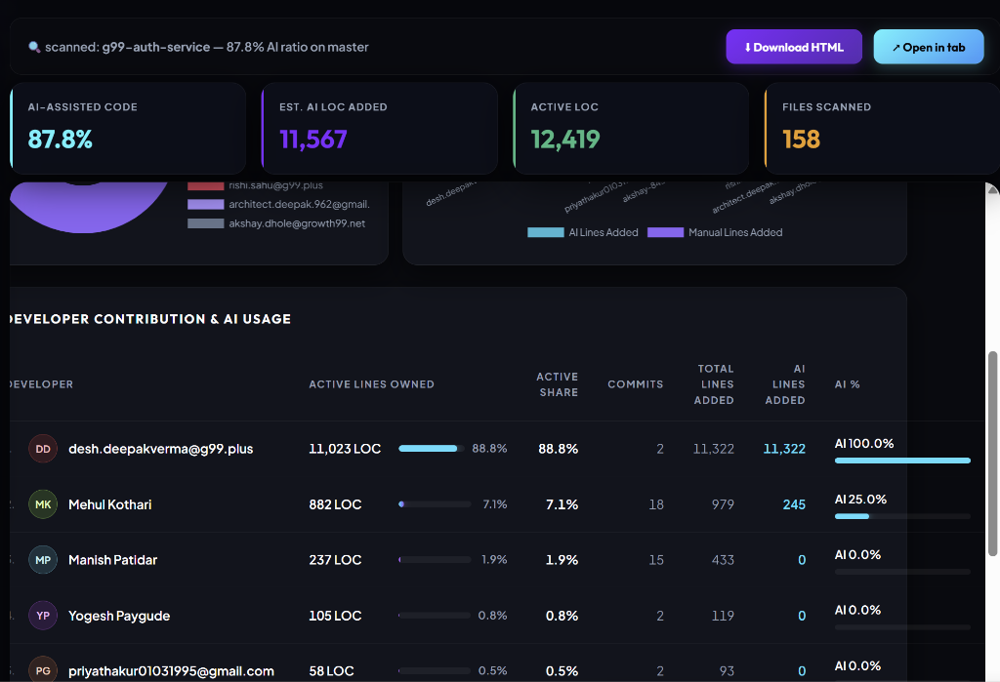

# 🔬 AI Code Attribution Tracker

<p align="center">
  
  
  
  
</p>

### ⚡ Forensic Git Blame & AI Code Fingerprint Analyzer

Estimates **what percentage of your codebase is AI-generated**, split by **AI Assistant** (Claude vs. Antigravity/Gemini) and by **Individual Developer**. Instead of relying on raw commit sizes, it uses line-ownership matching and structural signature analysis.

<p align="center">
  <a href="https://ai-code-attribution-tracker.onrender.com" target="_blank" style="text-decoration:none;">
    
  </a>
</p>

---

## 📸 Interactive Dashboard Preview

Below is the live console in action showing scan statistics, interactive developer contribution distributions, and the AI agent signature engine details.



---

## ✨ Key Features
* 🚀 **Dual Scan Modes:** 
  * **Bitbucket/GitHub Remote URL:** Clones, blames, and scans branches dynamically in the cloud.
  * **Local Folder Path:** Checks codebases on your drive instantly (perfect for local developer environments).
* 📊 **Real-time Logging & ETA:** Displays blaming filenames, elapsed times, and remaining scanning durations dynamically.
* 🤖 **Agent Style Fingerprints:** Classifies code blocks as Gemini/Antigravity or Claude by analyzing LLM writing tells rather than file edits.
* 🎨 **Widescreen Glassmorphic Interface:** Clean dark-mode dashboard styled with smooth micro-animations, color gradients, and native complete notifications.

---

## 🔬 Forensics: How It Identifies LLMs

To eliminate false-positives (like Prettier runs, package-lock files, or new-file creations), the scanner runs a **Heuristic Signature Engine** matching developer line-ownership back to specific assistant footprints:

| Heuristic Indicator | 🤖 Claude (Anthropic) | 🌌 Antigravity / Gemini (Google) |
| :--- | :--- | :--- |
| **Comment Dividers** | Numbered list steps (`// 1.`, `// 2.`) | Horizontal thick bars (`// ============`) |
| **Docstrings** | Standard JSDoc block headers above functions | Python-style docstrings embedded *inside* block brackets |
| **Header Styling** | Clean PascalCase headings | ALL-CAPS section banner headers |
| **Code Velocity** | File additions >120 LOC with <5% deletions | File additions >150 LOC with <5% deletions |

> [!NOTE]  
> The scanner combines signatures with **Human Tells** (common developer spelling mistakes like `dyanamic`, `recieve`, `tolltip`), using them to dynamically lower AI confidence score thresholds and prevent false-positives.

---

## 📊 Developer Attribution & Preferences
The scanner compiles interactive tables attributing code ownership directly to individual developers, displaying their preferred helper badge in real-time:


---

## 🛠️ Getting Started

### Local Setup
1. Clone the repository and install Node.js (v18+).
2. Start the local server:
   ```bash
   npm start
   ```
3. Open `http://localhost:4000` in your browser.

### Command Line Interface (CLI)
You can also run scans directly in the terminal:
```bash
# Scan a remote Git repository
node src/cli.js --repo https://bitbucket.org/workspace/repo.git --branch master

# Scan an existing local directory clone
node src/cli.js --path "E:/work/ui/g99-ui-widget" --name my-widget
```

Outputs compile to `./out/` as `report.html` (interactive UI) and `report.json` (machine-readable stats).

---

## 🐳 Docker Containerization
A `Dockerfile` is included to easily deploy the scanner console to container hosts (like Koyeb or AWS ECS):

```bash
# Build the Docker image
docker build -t ai-code-attribution-tracker .

# Run the container
docker run -p 4000:4000 ai-code-attribution-tracker
```
