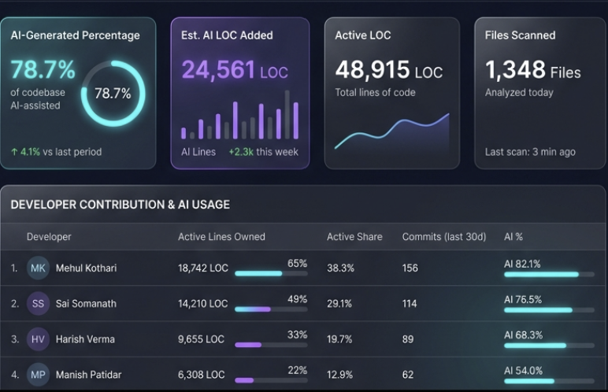
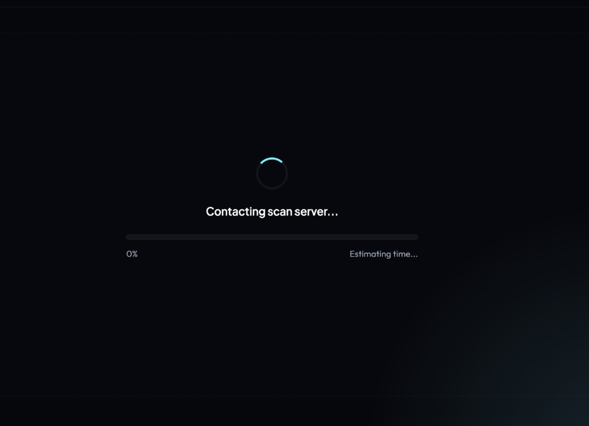

# 🔬 AI Code Scanner & Developer Forensics Console

Estimates **what share of a repository's code is AI-generated**, split by **AI Agent tool** (Antigravity/Gemini vs. Claude) and by **individual developer** — using forensic `git blame` line-ownership and **code-style fingerprinting**.


---

## ✨ Features
- 🚀 **Two Scan Modes:** Toggles dynamically between **Bitbucket Remote URL** (clones and blames on-the-fly) and **Local Folder Scan** (instantly checks codebases already on your disk).
- 📊 **Real-time Progress Tracker:** Displays step-by-step logs, blaming files progress, and estimated time remaining.
- 🤖 **AI Assistant Attribution:** Scans active source code for LLM-specific signature patterns to identify whether the code was generated by **Claude (Anthropic)** or **Antigravity / Gemini (Google)**, attributing them to individual developer shares.
- 🎨 **Premium UI Dashboard:** Dark glassmorphic widescreen layout with smooth animation, micro-interactions, and native browser complete notifications.
- 📉 **Responsive Interactive Charts:** Visualizes developer active lines distribution and AI vs. manual additions via Chart.js.

---

## 📸 Screenshots & Workflow

### 1. Ready to Scan (Initial State)
Clear and separate configuration paths for local repositories and Bitbucket remote servers.


### 2. Active Blaming & Loader State
Track active filenames, remaining times, and blaming percentages in real-time as Git compiled metrics.


### 3. Widescreen Dashboard & Interactive Charts
Presents a complete overview of files scanned, active LOC, estimated AI LOC, and developer distribution charts.


### 4. Developer Contribution & AI Agent Attribution Table
Displays individual statistics, AI percentage, and custom assistant preference badges (`CLAUDE` or `ANTIGRAVITY`), followed by executive AI agent preference ratios.


---

## 🛠️ Getting Started

### 1. Authentication (For Bitbucket Remote)
To scan private Bitbucket repositories, copy `.env.example` ➔ `.env` and fill **one** of the authentication credentials. Recommended: **Repository Access Token**.
```env
BITBUCKET_TOKEN=your_repository_access_token_here
```

### 2. Running Locally (No Installation Required)
Once configuration is completed, boot the server:
```bash
npm start
```
Open your browser and navigate to: `http://localhost:4000`

---

## 🖥️ Command Line Usage (CLI)

```bash
# Scan a remote repo on a specific branch
node src/cli.js --repo https://bitbucket.org/growth99_plus/g99-product-service.git --branch master

# Scan a local folder clone (super fast, no auth required)
node src/cli.js --path "E:/work/ui/g99-ui-widget" --name g99-ui-widget
```

The output compiles into `./out/` as:
1. `report.html` — A self-contained, interactive HTML dashboard.
2. `report.json` — Raw data structure designed for scorecard integration.

---

## 🐳 Docker Deployment (Optional)

Docker containerization makes it simple to deploy this tool 24/7 to cloud services like Koyeb, Fly.io, or AWS.

Create a `Dockerfile` in the root:
```dockerfile
FROM node:18-alpine
RUN apk add --no-cache git
WORKDIR /app
COPY package*.json ./
RUN npm install --production
COPY . .
EXPOSE 4000
CMD ["node", "src/server.js"]
```

Build and run:
```bash
docker build -t ai-code-scanner .
docker run -p 4000:4000 ai-code-scanner
```

---

## 🔬 How the Fingerprints Work
1. **Scope Exclusions:** Filters out `node_modules`, `dist`, lockfiles, third-party libraries, and spec files to keep metrics accurate.
2. **Velocity Heuristic:** Identifies bulk templates or copied blocks where a commit adds **>120 lines** with **<5% deletions** in a single file.
3. **LLM Signature Scanning:**
   * **Antigravity / Gemini:** Flags ALL-CAPS divider blocks (`// =======`), section headers, and Python-style docstrings embedded directly *inside* function bodies.
   * **Claude:** Flags numbered step comments (`// 1.`, `// 2.`), JSDoc headers, and high JSDoc density.
   * **Human tells:** borderlines are refined by matching common human typos (e.g. `dyanamic`, `recieve`, `tolltip`), reducing false-positives.
